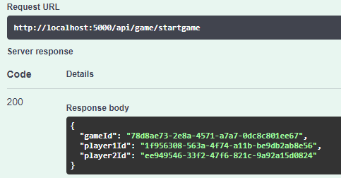

# TicTacToeApi
### TicTacToe API service using ASP.Net
#### Created by: Myles Borthwick
---
#### Introduction
The aim of this project was to make an API backend service around the simple game of TicTacToe.
Programmed in C# TicTacToe API leverages the tools provided by .Net 5.0 to service various endpoints.
Endpoints include:
1. StartGame (POST)
2. MakeMove (PUT)
3. GetGames (GET)

The contents of the ReadMe include a quick how-to with interaction demos, a brief run run down of the buisness logic design choices, notes on future improvement and finally a quick discussion on OAuth2/OIDC security for single page applications.

#### How To Run
**Docker**
This project contains a docker comose file which can be executed throught the command-line for quick setup.
Enter **'docker-compose up --build'** to create and start a new docker container.

**Swagger**
Next, navigate to  **'localhost:5000/swagger'** to use the built in API interface for easy interaction with the service's endpoints.

---

---

Access the avilable endpoints by clicking on the desired dropdown tab

To interact with the endpoint click try it out, enter the required input then select execute.

---

**Interaction Demos**

**Start/Create Game:** This Endpoint creates a new game and initializes players with the given names. Player 1 is initialized with the 'X symbol and Player 2 with 'Y'

The response for the above action returns a JSON DTO (data transfer object) as seen below:   

**Make Move:** Endpoint registers the given players move with at the corresponding location on the board representation.

The above action returns a DTO response showing the updated board array and a message notifying the player of the move's result (i.e win, tie, continue).

**Get Games:** Returns a list of active games. An example response can be seen below.

---

#### Business Logic

To spice things up a little bit I decided to avoid using nested for loops for traversing the board and checking win conditions. To achieve this the board can be flattened into a 2d array as see below:

**|**
**|**
**|**
**V**

Using this model and a few helper methods for retrieving sub arrays, win conditions can be evaluated as follows:
**Horizontal:** [0,1,2] , [3,4,5] , [6,7,8]
**Vertical:** [0,3,6] , [1,4,7] , [2,5,8]
**Diagonal** [0,4,8] , [2,4,6]

---

#### Future Steps
To take this project further unit and integration testing can/should be added to evaluate the code in a more robust way. Additionally it would be interesting to implement either an SQL or NoSQL database necessitating asynchronous programming as an added challenge. The current code is far from perfect in terms of business logic, certain elements should be fixed and expanded upon,including the ability for both players to be able to start the game... player 1 has the clear advantage here! Application security also needs attention bringing us to the last question.

---

#### Final Question: 
**What is the appropriate OAuth 2/OIDC grant to use for a web application using a SPA (Single Page Application) and why?**

An authorization grant is a credential that represents the resource owner's authorization to access protected resources used by the client for obtaining an access token. Grants can be broken down into four types: Authorization Code, Implicit, Resource Owner Password Credentials and Client Credentials.
**For SPAs the grant type that should be used is "Authorization Code"** which is obtained using an authorization server as an intermediary between the client and resource owner. This offers some security benefits like authenticating clients and ensuring access tokens are transmitted directly to clients reducing the token's exposure to others including the the resource owner.

For SPA applications, **Auth Code Flow + PKCE(Proof Key for Code Exchange)** is considered to be the best practice. One of the advantages of using PKCE is that users are not required to provide a 'client secret', effectively reducing security risks for SPAs since exposure to reverse engineering is limited due to embedded secrets not being required in source code.

Instead, the client app generates a unique string value called a 'code verifier' which is hasehed amd encoded as a code challenge. Once a client authenticates and the authorization code is sent to the client application, it requests an access token in exchange for the authorization code. The client application must then include the original string in the code verifier. If a match is detected authentication is complete and an access token is returned.

